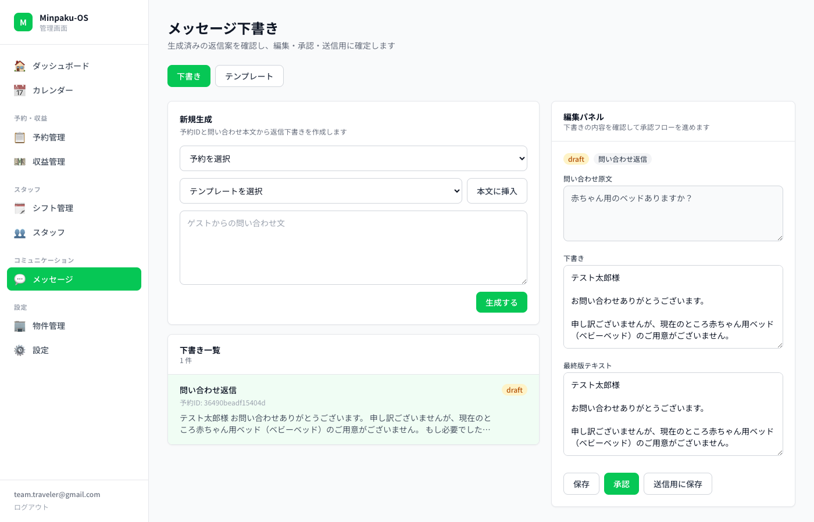
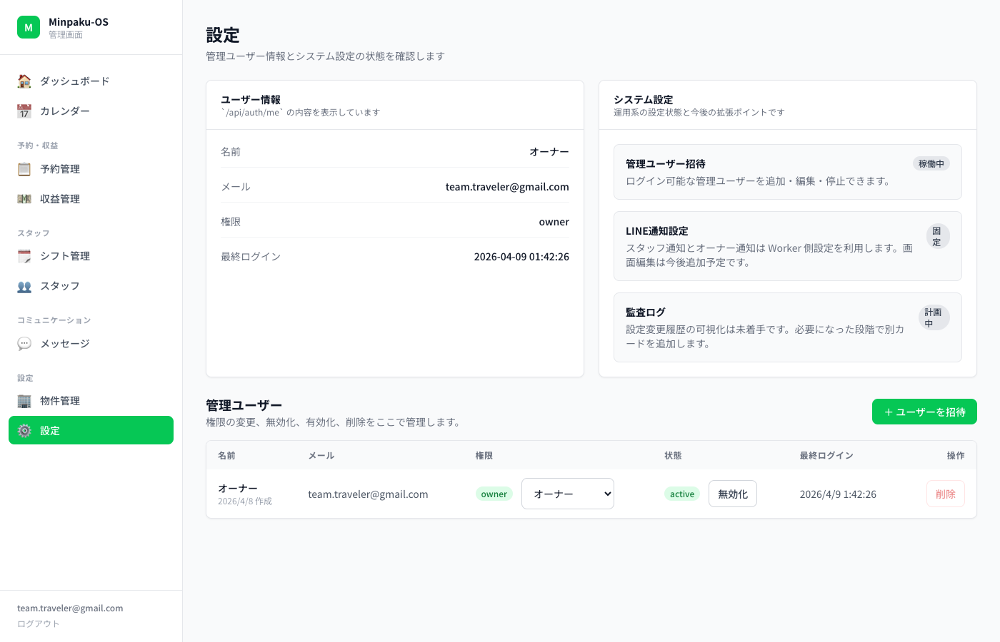

# Minpaku-OS

LINE + Cloudflare で動く、民泊オーナー向けオープンソース PMS（Property Management System）。

## 特徴

- **予約管理**: Airbnb / Booking.com の iCal 同期 + ダブルブッキング自動検知
- **LINE スタッフ管理**: シフト提案・承諾・完了報告をすべて LINE で
- **AI メッセージ生成**: 物件情報を元にゲスト返信を自動下書き（claude -p）
- **収益管理**: CSV/PDF インポート + 経費 + 人件費 → 営業利益を自動計算
- **180 日カウント**: 民泊新法の年間稼働日数を自動追跡 + LINE アラート
- **無料インフラ**: Cloudflare Workers (free) + D1 + Pages + VPS の claude -p

## スクリーンショット

| ダッシュボード | カレンダー |
|:---:|:---:|
|  |  |

| 予約管理 | 収益管理 |
|:---:|:---:|
|  |  |

| 物件管理 | スタッフ管理 |
|:---:|:---:|
|  |  |

| メッセージ | 設定 |
|:---:|:---:|
|  |  |

## アーキテクチャ

```
┌─────────────────────────────────────────────────┐
│  LINE Messaging API                              │
│  (スタッフ通知 / シフト管理 / リッチメニュー)       │
└───────────┬─────────────────────────────────────┘
            │ Webhook
┌───────────▼─────────────────────────────────────┐
│  Cloudflare Workers (apps/worker)                │
│  ├── 予約 CRUD + iCal 同期 (Cron)               │
│  ├── スタッフ・シフト管理                         │
│  ├── 収益・コスト・人件費管理                     │
│  ├── メッセージ下書き生成                         │
│  ├── 宿泊者名簿 (法定義務)                       │
│  ├── iCal フィード公開 (在庫ブロック)             │
│  └── JWT 認証 + 招待リンク                       │
│  D1 (SQLite) / KV                                │
└───────────┬─────────────────────────────────────┘
            │ API
┌───────────▼──────────┐  ┌───────────────────────┐
│  Cloudflare Pages     │  │  VPS Agent Server      │
│  (apps/admin)         │  │  (apps/agent)          │
│  React + Tailwind     │  │  Hono + claude -p      │
│  LINE Harness 風 UI   │  │  AI メッセージ生成     │
└──────────────────────┘  │  CSV/PDF パース         │
                           │  シフト提案             │
                           └───────────────────────┘
```

## セットアップ

### 前提条件

- Node.js 20+
- Cloudflare アカウント
- LINE Developers アカウント（Messaging API チャンネル）
- VPS（claude CLI インストール済み）

### 1. クローン & インストール

```bash
git clone https://github.com/your-username/minpaku-os.git
cd minpaku-os
npm install
```

### 2. Cloudflare リソース作成

```bash
npx wrangler d1 create minpaku-os
npx wrangler kv namespace create KV
```

`wrangler.toml` の `database_id` と KV `id` を更新。

### 3. DB マイグレーション

```bash
npx wrangler d1 execute minpaku-os --remote --file=packages/db/migrations/0001_initial.sql
npx wrangler d1 execute minpaku-os --remote --file=packages/db/migrations/0002_checklist.sql
npx wrangler d1 execute minpaku-os --remote --file=packages/db/migrations/0006_labor_costs.sql
npx wrangler d1 execute minpaku-os --remote --file=packages/db/migrations/0007_property_details.sql
```

### 4. シークレット設定

```bash
echo "your-secret" | npx wrangler secret put ADMIN_JWT_SECRET
echo "your-line-channel-secret" | npx wrangler secret put LINE_CHANNEL_SECRET
echo "your-line-access-token" | npx wrangler secret put LINE_CHANNEL_ACCESS_TOKEN
echo "your-line-channel-secret" | npx wrangler secret put LINE_STAFF_CHANNEL_SECRET
echo "your-line-access-token" | npx wrangler secret put LINE_STAFF_ACCESS_TOKEN
```

### 5. 管理ユーザー登録

```bash
npx wrangler d1 execute minpaku-os --remote \
  --command="INSERT INTO admin_users (email, name, role) VALUES ('you@example.com', 'オーナー', 'owner')"
```

### 6. デプロイ

```bash
# Worker
npx wrangler deploy

# Admin UI
cd apps/admin
VITE_API_BASE_URL=https://your-worker.workers.dev npm run build
npx wrangler pages deploy dist --project-name minpaku-os-admin
```

### 7. Agent (VPS)

```bash
cd apps/agent
npm install
npx tsc -p tsconfig.json
PORT=8788 node dist/index.js
```

`wrangler.toml` の `AGENT_ENDPOINT` を VPS の URL に設定して再デプロイ。

### 8. LINE Webhook 設定

LINE Developers コンソールで Webhook URL を設定:

```
https://your-worker.workers.dev/webhook/line
```

LINE Official Account Manager で:
- 応答メッセージ → オフ
- Webhook → オン

## 管理画面

| ページ | 機能 |
|--------|------|
| ダッシュボード | 今日の予約状況 / 180日カウント / 稼働率 |
| カレンダー | 月間予約カレンダー (FullCalendar) |
| 予約管理 | 一覧 / フィルタ / 手動登録 / ステータス変更 / 売上入力 / 宿泊者名簿 |
| 収益管理 | 売上サマリー / CSV・PDFインポート / 経費登録 / 人件費 / 営業利益 |
| シフト管理 | AI シフト提案 / 確認・確定フロー |
| スタッフ | 招待 / 時給・日給設定 / LINE連携 |
| メッセージ | AI下書き生成 / テンプレート / 承認フロー |
| 物件管理 | 物件情報 / iCal URL / チェックリスト / マニュアルURL / iCalフィード公開 |
| 設定 | 管理ユーザー招待 (リンク方式) / システム設定 |

## LINE コマンド

| コマンド | 機能 |
|---------|------|
| 予約 | 今後の予約一覧 |
| 今日のシフト | 本日のシフト確認 |
| チェックリスト | 清掃チェックリスト + マニュアルURL |
| 管理画面 | 管理画面 URL |
| OK / NG | シフト承諾 / 辞退 |
| 完了 | タスク完了報告 → 人件費自動計算 |
| ヘルプ | コマンド一覧 |

## 技術スタック

| レイヤー | 技術 |
|---------|------|
| Backend | Cloudflare Workers + D1 (SQLite) + KV |
| Frontend | React + Vite + Tailwind CSS |
| AI | claude -p (Claude Max サブスク内) |
| Messaging | LINE Messaging API |
| Hosting | Cloudflare Pages (Admin) + Workers (API) |

## ライセンス

MIT
