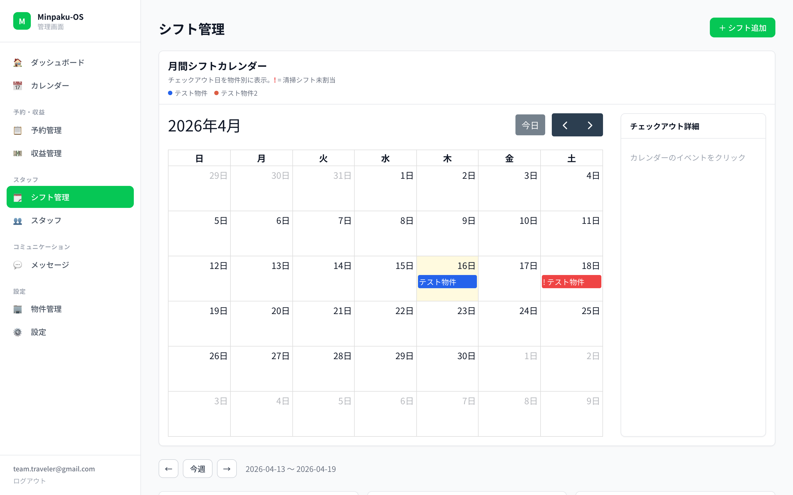

# Minpaku-OS

LINE × Cloudflare で動く、民泊オーナー向けオープンソース PMS（Property Management System）。
**月額0円のインフラで、商用 PMS（月1〜3万円）と同じことを実現します。**

## 🚀 クイックスタート（ワンコマンド）

```bash
npx create-minpaku-os@latest
```

対話型ウィザードが **クローン → Cloudflare リソース作成 → マイグレーション → シークレット登録 → デプロイ** まで自動で実行します（所要 5〜10分）。

事前に LINE Developers Console でチャネルを2つ作成しておくだけで OK です（詳細は [セットアップガイド](https://minpaku-os-admin.pages.dev/setup)）。

> 📘 **手動でセットアップする場合**: `https://<あなたの admin URL>/setup` で8ステップの詳細手順を確認できます。

## 特徴

- 📅 **iCal 双方向同期** — Airbnb / Booking.com / 自社HP の予約を毎時自動同期 + ダブルブッキング検知 + キャンセル自動検知
- 💬 **LINE スタッフ管理** — シフト通知 / 承諾 / 完了報告 / 写真送信まで全部 LINE 内で完結
- 📲 **LIFF カレンダー** — スタッフが LINE 内でカレンダー UI からシフト希望を入力
- 📆 **カレンダーからシフト依頼** — 予約をクリック → スタッフ選択 → LINE で確認送信（ワンクリック）
- 📊 **180日カウント** — 民泊新法の年間稼働日数を自動追跡 + 上限警告
- 💰 **収益・人件費管理** — 売上 - 経費 - 人件費 = 営業利益を物件ごとに自動計算
- 🧹 **清掃チェックリスト** — 物件ごとの項目をスタッフへ LINE 配信、完了後に未チェック警告
- ✉️ **管理画面から LINE 送信** — 個別 / 役割別 / 全員に一斉配信（LINE Multicast）
- 📱 **レスポンシブ対応** — PC / スマホどちらでも快適に操作可能
- 🔔 **自動レポート** — 日次レポート（23:00）/ 週次レポート（月曜09:00）をマネージャーへ自動配信
- 🏷️ **リッチメニュー** — 役割別の LINE リッチメニュー自動切替（マネージャー / 清掃 / チェックイン）
- ⚡ **Cloudflare 無料運用** — Workers + D1 + Pages + KV の無料枠内で完結

## スクリーンショット

| ダッシュボード | カレンダー |
|:---:|:---:|
|  |  |

| 予約管理 | 収益管理 |
|:---:|:---:|
|  |  |

| 物件管理 | スタッフ管理 |
|:---:|:---:|
|  |  |

| シフト管理 | 設定 |
|:---:|:---:|
|  |  |

## アーキテクチャ

```
┌─────────────────────────────────────────────────┐
│  LINE Messaging API + LIFF（Tall）              │
│  スタッフ通知 / シフト管理 / カレンダー入力       │
└───────────┬─────────────────────────────────────┘
            │ Webhook / LIFF
┌───────────▼─────────────────────────────────────┐
│  Cloudflare Workers (apps/worker)                │
│  ├── 予約 CRUD + iCal 同期（毎時 cron）          │
│  ├── スタッフ・シフト管理                         │
│  ├── 収益・コスト・人件費管理                     │
│  ├── 宿泊者名簿（法定義務）                       │
│  ├── iCal フィード公開（在庫ブロック）            │
│  ├── LINE 個別/一斉メッセージ配信                 │
│  └── JWT 認証 + 招待リンク                       │
│  D1 (SQLite) / KV                                │
└───────────┬─────────────────────────────────────┘
            │ API
┌───────────▼──────────┐  ┌───────────────────────┐
│  Cloudflare Pages     │  │  VPS Agent（任意）     │
│  apps/admin           │  │  apps/agent            │
│  React + Tailwind     │  │  Hono + claude -p      │
│  ・管理画面            │  │  AI 機能用             │
│  ・LIFF カレンダー     │  │  - シフト提案          │
│  ・/setup ガイド       │  │  - メッセージ生成      │
└──────────────────────┘  │  - CSV/PDF 取込        │
                           └───────────────────────┘
```

## クイックスタート（要約）

詳細は **デプロイ後の `/setup` ページ**を参照してください。8ステップに整理されており、コマンドにコピーボタンが付いています。

```bash
# 1. クローン & インストール
git clone https://github.com/traveler0215/minpaku-os.git
cd minpaku-os && npm install

# 2. Cloudflare リソース作成（ID を wrangler.toml に貼り付け）
npx wrangler login
npx wrangler d1 create minpaku-os
npx wrangler kv namespace create KV

# 3. マイグレーション適用
for f in packages/db/migrations/*.sql; do
  npx wrangler d1 execute minpaku-os --remote --file=$f
done

# 4. LINE Messaging API + LINEログイン（LIFF）チャネル作成
#    → secret/token/LIFF ID を取得（手動）
#    → wrangler.toml の LIFF_ID を更新

# 5. シークレットを wrangler に投入
openssl rand -hex 32 | npx wrangler secret put ADMIN_JWT_SECRET
npx wrangler secret put LINE_CHANNEL_SECRET
npx wrangler secret put LINE_CHANNEL_ACCESS_TOKEN
npx wrangler secret put LINE_STAFF_CHANNEL_SECRET
npx wrangler secret put LINE_STAFF_ACCESS_TOKEN

# 6. デプロイ
npx wrangler deploy
cat > apps/admin/.env.production <<EOF
VITE_API_BASE_URL=https://<your-worker-url>
VITE_LIFF_ID=<your-liff-id>
EOF
cd apps/admin && npm run build && cd ../..
npx wrangler pages deploy apps/admin/dist --project-name minpaku-os-admin

# 7. 管理ユーザー登録
npx wrangler d1 execute minpaku-os --remote \
  --command="INSERT INTO admin_users (email, name, role) VALUES ('you@example.com', 'オーナー', 'owner')"

# 8. LINE Webhook URL に https://<your-worker-url>/webhook/line を設定
#    LINE Official Account Manager → 応答メッセージ OFF / Webhook ON
```

## VPS について

**VPS は必須ではありません。** 以下の AI 機能を使う場合のみ必要です：

- 🤖 シフト自動提案
- 🤖 ゲストメッセージ AI 下書き生成
- 🤖 売上 CSV/PDF の AI 取込

それ以外（予約・スタッフ・物件・収益・LINE シフト管理・iCal 同期・LIFF カレンダー）は **VPS なしで動作**します。

VPS を後から追加する場合は `apps/admin/.env.production` に `VITE_AGENT_ENABLED=true` を追加して再ビルドしてください。

## 技術スタック

| レイヤー | 技術 |
|---------|------|
| Backend | Cloudflare Workers + D1 (SQLite) + KV |
| Frontend | React + Vite + Tailwind CSS |
| LINE | Messaging API + LIFF (Tall) |
| AI（任意） | claude -p（Claude Max サブスク内） |
| Hosting | Cloudflare Pages（Admin） + Workers（API） |

## 管理画面

| ページ | 機能 |
|--------|------|
| ダッシュボード | 今日の予約 / 180日カウント / 稼働率 |
| カレンダー | 月間予約カレンダー（FullCalendar）/ 物件別色分け / シフト依頼 / 予約削除 |
| 予約管理 | 一覧 / フィルタ / 手動登録 / 売上入力 / 宿泊者名簿 |
| 収益管理 | 売上サマリー / 経費登録 / 人件費 / 営業利益（PDF/CSV取込は任意の AI 機能） |
| シフト管理 | 週ナビゲーション / 月間シフトカレンダー（CO日表示 + 未割当警告）/ 未確定・確定シフト分離 / シフト希望マトリクス |
| スタッフ | 招待 / 役割 / 担当物件 / 時給 / LINE 連携 / 個別・一斉メッセージ送信 |
| 物件管理 | 基本情報 / iCal URL（Airbnb/Booking/自社HP）/ チェックリスト / マニュアル URL |
| メッセージ | AI 下書き生成（任意の AI 機能）/ テンプレート / 送信フロー |
| 設定 | 管理ユーザー招待 / LINE 通知設定（予定なし日のレポートON/OFF）/ LINE 表示設定（ゲスト名非表示 / プラットフォーム表示）|

## LINE コマンド

| コマンド | 機能 | 備考 |
|---------|------|------|
| `予約` | 今後の予約一覧 | 英語: `reservations` |
| `今日のシフト` | 本日のシフト確認 | 英語: `shift` |
| `チェックリスト` | 清掃チェックリスト + マニュアル URL | 英語: `checklist` |
| `管理画面` | 管理画面 URL | マネージャー専用。英語: `admin` |
| `OK` / `NG` | シフト承諾 / 辞退 | ボタン（Postback）でも可 |
| `完了` | タスク完了報告 → 人件費自動計算 | |
| `ヘルプ` / `？` | コマンド一覧 | 英語: `help`。役割に応じて表示が変わる |
| 📷 写真送信 | 清掃完了写真を保存 | 直近のシフトに自動紐付け |

**スタッフ登録**: LINE 友だち追加後に6桁の招待コードを入力すると自動登録され、役割に応じたリッチメニューが設定されます。

## 定期実行（Cron）

| スケジュール | 処理 |
|-------------|------|
| 毎時0分 | iCal 同期（Airbnb / Booking / 自社HP）+ ダブルブッキング検知 + キャンセル検知 |
| 毎日 08:00 JST | 当日チェックアウト → 清掃タスク自動発行（LINE 通知）/ 前日チェックイン → ステータス更新 |
| 毎日 23:00 JST | 翌日チェックイン確認（オーナーへ通知）/ 日次レポート（マネージャーへ配信） |
| 毎週月曜 09:00 JST | シフト希望収集（LIFF リンクをスタッフへ配信）/ 週次レポート（稼働率・売上） |

## 必要条件

- Node.js 20+
- Cloudflare アカウント（無料プラン可）
- LINE Developers アカウント（チャネル2つ: Messaging API + LINE ログイン/LIFF）

## ライセンス

MIT
